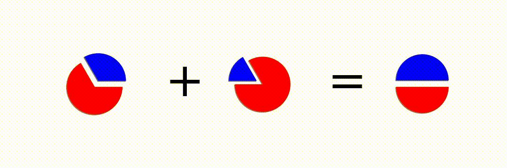

# Matematica-ONGEP

Repositório contendo material (apresentações de slides, código, diagramas, infográficos e listas de exercícios) usados nas aulas de Matemática do cursinho popular ONGEP

*In English: Repository with material (presentations, code, diagrams, infographics and exercises) used in Math classes for the popular preparatory course for university admission exams ONGEP*

